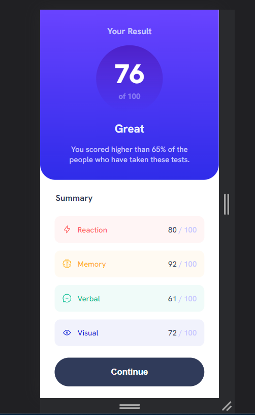

# Frontend Mentor - Results summary component solution

This is a solution to the [Results summary component challenge on Frontend Mentor](https://www.frontendmentor.io/challenges/results-summary-component-CE_K6s0maV). Frontend Mentor challenges help you improve your coding skills by building realistic projects.

## Table of contents

- [Overview](#overview)
  - [Screenshot](#screenshot)
  - [Links](#links)
- [My process](#my-process)
  - [Built with](#built-with)
- [Author](#author)

## Overview

### Screenshot

### Links

- Solution URL: [solution](https://www.frontendmentor.io/solutions/results-summary-component-solution-9uiQVmOnPf)
- Live Site URL: [live](https://loniewski02.github.io/results-summary-component/)

## My process

### Built with

- Semantic HTML5 markup
- SASS
- Flexbox
- Mobile-first workflow
- JavaScript

## Author

- Frontend Mentor - [@Loniewski02](https://www.frontendmentor.io/profile/Loniewski02)
